# Paper Results Figures

中文 · [English](README.md)

调用 `$paper-results-figures`，提供结果数据并说明比较需求，即可生成可复现的论文图。可以选择下面的预览并复制简短 Prompt，也可以让 Agent 选择适合的数据图形。支持检查并适配 CSV、TSV 和 XLSX；工作簿有多个相关工作表时，请指定要使用的工作表。

```text
使用 $paper-results-figures 比较 INPUT_DATA_PATH 中的不同方法。
每个 observation_id 是独立的观测单位，不同方法之间按该 ID 配对。
score 是 [0,1] 范围的无量纲分数，越高越好，突出显示 Ours。
使用纵向小提琴图，显示原始散点，色板 rainbow-transparent。
将结果保存到 OUTPUT_PARENT。
```

替换输入路径和输出文件夹。如果数据本身无法明确说明，请给出指标含义、观测单位、配对关系和改善方向。使用图库 Prompt 时，可以直接提供附带的 CSV，也可以换成自己的结果数据。Agent 会完成明确的列映射，创建最小绘图请求，检查图片并导出结果。

## 将图库 Prompt 换成自己的数据

每张预览都链接到一段可复制的提示词，统一分为两部分。使用随附合成 CSV 时，只改 `INPUT_DATA_PATH` 和 `OUTPUT_PARENT`；使用自己的 CSV、TSV 或 XLSX 时，修改 **DATA SETTINGS（数据设置）** 中的值，保留 **FIGURE SETTINGS（图形设置）** 即可沿用展示图的布局与配色。

| 数据设置中的项目 | 换成自己的数据时修改什么 |
| --- | --- |
| Input file / output parent | 输入文件和输出目录；XLSX 必要时补充工作表名 |
| Column mapping | 将示例列名换成自己的表头；明确无歧义的映射也可填 `auto` 让 Agent 识别 |
| Metric definitions | 指标名称、单位、有科学依据的取值域和改善方向；没有已知取值域时填写“no established domain” |
| Sampling / pairing / input meaning | 每行或每个 ID 代表什么、观测是否独立、方法间是否配对、数值是原始观测还是汇总值 |
| Focal / reference method | 自己的方法和参考方法在表中的实际名称；不需要时填 `none` |
| Test / order / selected IDs / omitted interval | 检查该图包含的项目：检验假设、指标或类别顺序、指定标记的观测、断轴区间 |
| Axis labels | 自己的科学标签及单位 |

示例填写的内容只描述随附的虚构数据。Agent 可以识别表头，但独立性、配对关系、改善方向和检验假设需要科学说明；取值域也不等于数据的最小值与最大值。Agent 会检查图形适用性，并在分析依赖的信息不明确时询问。字体、画布、间距和图例适配使用 Skill 默认设置。

## 支持的图形

| 科学比较 | 图形形式 |
| --- | --- |
| 相同观测上的两个方法 | 等尺度配对散点图；分类或连续配色、点大小、指定星形标记和可选边际分布 |
| 单指标多方法 | 横向或纵向柱形、箱线、小提琴和均值线；可选散点、标准差、配对参考差值和指定方法检验 |
| 多指标多方法 | 独立数值轴、并列或纵向面板、双轴、可附柱形的共轴均值线、分组柱形/箱线/小提琴 |
| 随连续变量或类别的变化 | 线性或多项式拟合、可选均值置信区间、指标独立轴、仅外侧共享分类标签的趋势面板 |
| 多轴指标轮廓 | 基于明确科学取值域的雷达图、突出方法原始值和多种固定色板 |
| 组内条目的配对方法比较 | 按组计数成比例的环形热图、模型轨道、分组色带和同批条目的配套小提琴图 |

分布与配对差值需要原始观测；汇总值无法还原重复观测或不确定性。共轴指标必须具有相同的已知单位和取值域，雷达图的缩放范围也须有科学依据。按需显示的双轴相关系数使用各方法的均值配对计算，不混合所有原始行。

## 外观与输出

分类比较通常从 57 × 46 mm 起步；配对散点、趋势和分组分布通常从 57 × 54 mm 起步。每行四图时，宽度为 42 mm；组合布局使用规定的画布分配。所有文字均使用真实 Arial 字体。默认规则处理轴间距、可读刻度、文字适配和安全图例位置。纵向方法比较中，指定突出的方法放在最左侧；横向比较中放在最下方。明确的科学排序优先。较密集的分组箱线图与小提琴图省略内部均值和标准差标记。按方法配色时，默认把指定的焦点方法（或名为 Ours 的方法）放在独立的色相组中，避免与对手混淆；指定色图、按指标配色和连续数值色轴保持各自含义。雷达图采用白色背景、实线外框和虚线内部网格，也可选择带装饰性绿色渐变环带的版本。

分组环形热图支持 1–12 个组，采用整行 180 × 168 mm 画布，默认使用更浅的蓝绿紫色系；小提琴整体右端略超出实际显示的扇形条目文字右端；默认右侧一列以三位小数显示各模型的均值。每个条目只属于一个组，每个模型均有该条目的一个分数。热图和可选小提琴图使用相同的完整配对样本，扣除组间空隙后，扇区角度与各组的唯一条目数成比例。模型标题到环形轨道起点和小提琴图起点的水平留白相等。最多六个组时分组计数图例放在内部，更多组时移到右侧带边框的图例中；中心孔与图例行数随选定位置调整，径向标签根据条目密度自动稀疏显示，所有分数色块仍完整保留。长标签或拥挤布局可能需要缩短显示标签、减少显示的条目标签，或增大画布。

方法和分组色板默认跟随 `heatmap_palette`，使小提琴填色、内部分组色带与热图协调。可分别用 `palette` 和 `group_palette` 独立选择方法与分组色板。浅色蓝绿紫与蓝黄色板各提供十二个固定且协调的分组色位，方法色位保持原有规则。当其他默认继承的热图色板无法提供足够的分组颜色时，渲染器记录采用固定 12 色位的 `muted-balanced-twelve` 色板，避免循环复用分组颜色。显式指定的 `group_palette` 需要有足够的固定分组色位；显式分组颜色映射优先。分组图例显示各组的唯一条目数。`group_legend_placement` 可选 `auto`、`center` 或 `right`；`show_mean: false` 关闭描述性均值列。需要检验时，设置 `show_significance: true`、显式的 `significance_model` 与 `independent_items: true`；采用按条目身份配对的单侧 t 检验，将指定模型与每个其他展示模型比较，默认使用 Holm 校正。显著性会替代均值列。只有全部校正后检验通过 p < 0.05 时才在右侧画灰色括号，否则显示 `Brackets omitted`，全部结果仍保留记录。在原始数值浮点精度内无法区分的配对差值会记录为不可检验。单个括号的侧栏较窄时，校正标题放到单独的上方一行，以保留小提琴宽度。不能从配对或分组标签推断独立性。1、3、8 组预览展示检验，其他预览保留描述性均值。小提琴标题、刻度与侧边标注采用更大的 Arial 字体，并按实际文字尺寸适配布局。

每张图在输出目录中有独立文件夹，包含矢量 PDF、可编辑 SVG、600 dpi PNG、最终配置、绘图数据、统计记录和 R 会话记录。保留配置及输入适配步骤即可复现。修改同一张图时沿用其文件夹，并保持科学数值不变。

## 合成数据预览

每张预览都有独立文件夹，包含可直接使用的 Prompt 和固定 CSV 链接。分数示例中的 `Ours` 表现最好，较弱方法使差异更直观。相关图形和色板重复使用相同输入，Prompt 无须用户自行生成数据。展示卡片尺寸一致，完整容纳原图且不拉伸。

### 配对观测

<table><tr>
<td align="center" width="300"><a href="examples/paired-comparison-scatter/prompt.md">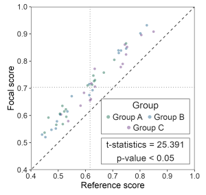</a><br><strong>分类配色的配对散点图</strong><br><code>muted-green-blue-purple</code><br><a href="examples/paired-comparison-scatter/prompt.md">Prompt 与 CSV</a> · <a href="examples/paired-comparison-scatter/preview.png">实际导出</a></td>
<td align="center" width="300"><a href="examples/paired-comparison-scatter-continuous/prompt.md">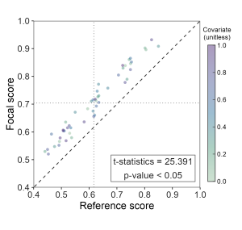</a><br><strong>连续数值配色的配对散点图</strong><br><code>muted-green-blue-purple</code><br><a href="examples/paired-comparison-scatter-continuous/prompt.md">Prompt 与 CSV</a> · <a href="examples/paired-comparison-scatter-continuous/preview.png">实际导出</a></td>
</tr></table>

<table><tr>
<td align="center" width="300"><a href="examples/paired-comparison-scatter-size-stars/prompt.md">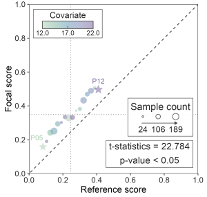</a><br><strong>点大小与指定星形标记</strong><br><code>muted-green-blue-purple</code><br><a href="examples/paired-comparison-scatter-size-stars/prompt.md">Prompt 与 CSV</a> · <a href="examples/paired-comparison-scatter-size-stars/preview.png">实际导出</a></td>
<td align="center" width="300"><a href="examples/paired-comparison-scatter-marginals/prompt.md">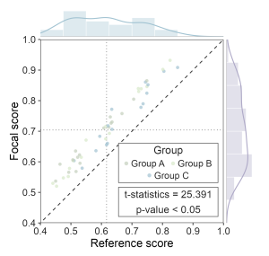</a><br><strong>边际直方图与密度曲线</strong><br><code>rainbow-transparent</code><br><a href="examples/paired-comparison-scatter-marginals/prompt.md">Prompt 与 CSV</a> · <a href="examples/paired-comparison-scatter-marginals/preview.png">实际导出</a></td>
</tr></table>

### 单指标多方法

<table><tr>
<td align="center" width="300"><a href="examples/mutl-comparison/prompt.md">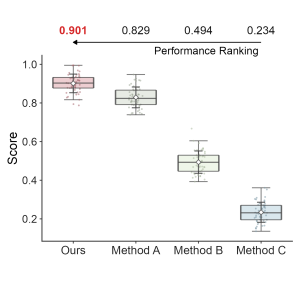</a><br><strong>箱线图、散点与标准差</strong><br><code>rainbow-transparent</code><br><a href="examples/mutl-comparison/prompt.md">Prompt 与 CSV</a> · <a href="examples/mutl-comparison/preview.png">实际导出</a></td>
<td align="center" width="300"><a href="examples/mutl-comparison-violin/prompt.md">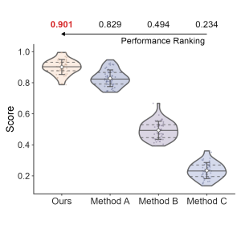</a><br><strong>小提琴图、散点与标准差</strong><br><code>blue-pink-purple-peach-transparent</code><br><a href="examples/mutl-comparison-violin/prompt.md">Prompt 与 CSV</a> · <a href="examples/mutl-comparison-violin/preview.png">实际导出</a></td>
<td align="center" width="300"><a href="examples/mutl-comparison-bar-horizontal/prompt.md">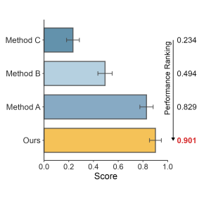</a><br><strong>横向均值柱形图</strong><br><code>blue-yellow</code><br><a href="examples/mutl-comparison-bar-horizontal/prompt.md">Prompt 与 CSV</a> · <a href="examples/mutl-comparison-bar-horizontal/preview.png">实际导出</a></td>
</tr></table>

<table><tr>
<td align="center" width="300"><a href="examples/mutl-comparison-reference-line/prompt.md">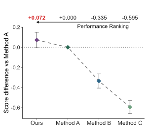</a><br><strong>配对参考差值</strong><br><code>muted-green-blue-purple-transparent</code><br><a href="examples/mutl-comparison-reference-line/prompt.md">Prompt 与 CSV</a> · <a href="examples/mutl-comparison-reference-line/preview.png">实际导出</a></td>
<td align="center" width="300"><a href="examples/mutl-comparison-four-column/prompt.md">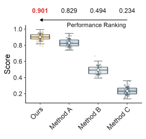</a><br><strong>四栏论文尺寸</strong><br><code>blue-yellow-transparent</code><br><a href="examples/mutl-comparison-four-column/prompt.md">Prompt 与 CSV</a> · <a href="examples/mutl-comparison-four-column/preview.png">实际导出</a></td>
</tr></table>

<table><tr>
<td align="center" width="300"><a href="examples/mutl-comparison-significance/prompt.md">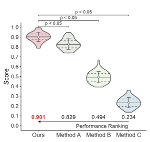</a><br><strong>纵向显著性括号</strong><br><code>rainbow-transparent</code><br><a href="examples/mutl-comparison-significance/prompt.md">Prompt 与 CSV</a> · <a href="examples/mutl-comparison-significance/preview.png">实际导出</a></td>
<td align="center" width="300"><a href="examples/mutl-comparison-significance-horizontal/prompt.md">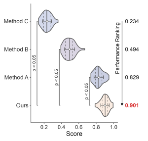</a><br><strong>横向显著性括号</strong><br><code>blue-pink-purple-peach-transparent</code><br><a href="examples/mutl-comparison-significance-horizontal/prompt.md">Prompt 与 CSV</a> · <a href="examples/mutl-comparison-significance-horizontal/preview.png">实际导出</a></td>
</tr></table>

### 多指标多方法

<table><tr>
<td align="center" width="300"><a href="examples/multi-metric-shared-rows/prompt.md">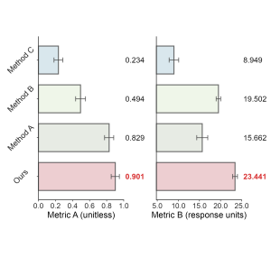</a><br><strong>并列柱形图，外侧数值</strong><br><code>rainbow-transparent</code><br><a href="examples/multi-metric-shared-rows/prompt.md">Prompt 与 CSV</a> · <a href="examples/multi-metric-shared-rows/preview.png">实际导出</a></td>
<td align="center" width="300"><a href="examples/multi-metric-shared-rows-inside/prompt.md">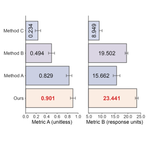</a><br><strong>并列柱形图，内部数值</strong><br><code>blue-pink-purple-peach-transparent</code><br><a href="examples/multi-metric-shared-rows-inside/prompt.md">Prompt 与 CSV</a> · <a href="examples/multi-metric-shared-rows-inside/preview.png">实际导出</a></td>
<td align="center" width="300"><a href="examples/multi-metric-shared-rows-no-sd/prompt.md">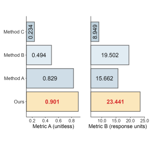</a><br><strong>并列柱形图，不显示标准差</strong><br><code>blue-yellow-transparent</code><br><a href="examples/multi-metric-shared-rows-no-sd/prompt.md">Prompt 与 CSV</a> · <a href="examples/multi-metric-shared-rows-no-sd/preview.png">实际导出</a></td>
</tr></table>

<table><tr>
<td align="center" width="300"><a href="examples/multi-metric-stacked-bars/prompt.md">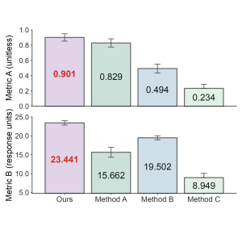</a><br><strong>纵向排列的柱形面板</strong><br><code>muted-green-blue-purple-transparent</code><br><a href="examples/multi-metric-stacked-bars/prompt.md">Prompt 与 CSV</a> · <a href="examples/multi-metric-stacked-bars/preview.png">实际导出</a></td>
<td align="center" width="300"><a href="examples/multi-metric-shared-axis/prompt.md">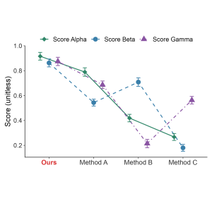</a><br><strong>同一数值轴上的多指标均值线</strong><br><code>muted-green-blue-purple-transparent</code><br><a href="examples/multi-metric-shared-axis/prompt.md">Prompt 与 CSV</a> · <a href="examples/multi-metric-shared-axis/preview.png">实际导出</a></td>
<td align="center" width="300"><a href="examples/multi-metric-shared-axis-bars/prompt.md">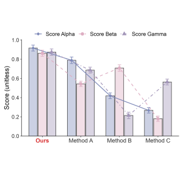</a><br><strong>均值线与图标下方的柱形</strong><br><code>blue-pink-purple-peach-transparent</code><br><a href="examples/multi-metric-shared-axis-bars/prompt.md">Prompt 与 CSV</a> · <a href="examples/multi-metric-shared-axis-bars/preview.png">实际导出</a></td>
</tr></table>

<table><tr>
<td align="center" width="300"><a href="examples/multi-metric-comparison-dual-axis/prompt.md">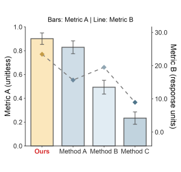</a><br><strong>双轴，按方法配色</strong><br><code>blue-yellow-transparent</code><br><a href="examples/multi-metric-comparison-dual-axis/prompt.md">Prompt 与 CSV</a> · <a href="examples/multi-metric-comparison-dual-axis/preview.png">实际导出</a></td>
<td align="center" width="300"><a href="examples/multi-metric-comparison-dual-axis-by-metric/prompt.md">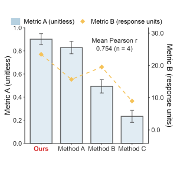</a><br><strong>双轴，按指标配色及均值相关系数</strong><br><code>blue-yellow-transparent</code><br><a href="examples/multi-metric-comparison-dual-axis-by-metric/prompt.md">Prompt 与 CSV</a> · <a href="examples/multi-metric-comparison-dual-axis-by-metric/preview.png">实际导出</a></td>
</tr></table>

### 分组分布

<table><tr>
<td align="center" width="300"><a href="examples/grouped-distributions-bar-vertical/prompt.md">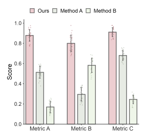</a><br><strong>纵向分组柱形</strong><br><code>rainbow-transparent</code><br><a href="examples/grouped-distributions-bar-vertical/prompt.md">Prompt 与 CSV</a> · <a href="examples/grouped-distributions-bar-vertical/preview.png">实际导出</a></td>
<td align="center" width="300"><a href="examples/grouped-distributions-bar-horizontal/prompt.md">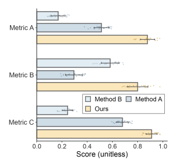</a><br><strong>横向分组柱形</strong><br><code>blue-yellow-transparent</code><br><a href="examples/grouped-distributions-bar-horizontal/prompt.md">Prompt 与 CSV</a> · <a href="examples/grouped-distributions-bar-horizontal/preview.png">实际导出</a></td>
<td align="center" width="300"><a href="examples/grouped-distributions-box-vertical/prompt.md">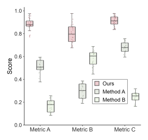</a><br><strong>纵向分组箱线图</strong><br><code>rainbow-transparent</code><br><a href="examples/grouped-distributions-box-vertical/prompt.md">Prompt 与 CSV</a> · <a href="examples/grouped-distributions-box-vertical/preview.png">实际导出</a></td>
</tr></table>

<table><tr>
<td align="center" width="300"><a href="examples/grouped-distributions-box-horizontal/prompt.md">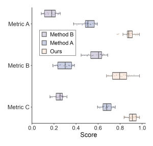</a><br><strong>横向分组箱线图</strong><br><code>blue-pink-purple-peach-transparent</code><br><a href="examples/grouped-distributions-box-horizontal/prompt.md">Prompt 与 CSV</a> · <a href="examples/grouped-distributions-box-horizontal/preview.png">实际导出</a></td>
<td align="center" width="300"><a href="examples/grouped-distributions-violin-vertical/prompt.md">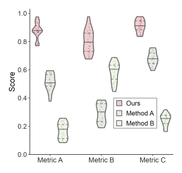</a><br><strong>纵向分组小提琴图</strong><br><code>rainbow-transparent</code><br><a href="examples/grouped-distributions-violin-vertical/prompt.md">Prompt 与 CSV</a> · <a href="examples/grouped-distributions-violin-vertical/preview.png">实际导出</a></td>
</tr></table>

<table><tr>
<td align="center" width="300"><a href="examples/grouped-distributions-violin-horizontal/prompt.md">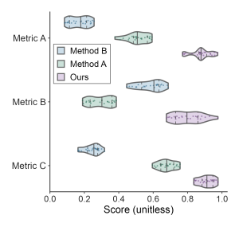</a><br><strong>横向分组小提琴图</strong><br><code>muted-green-blue-purple-transparent</code><br><a href="examples/grouped-distributions-violin-horizontal/prompt.md">Prompt 与 CSV</a> · <a href="examples/grouped-distributions-violin-horizontal/preview.png">实际导出</a></td>
<td align="center" width="300"><a href="examples/grouped-distributions-legend-space/prompt.md">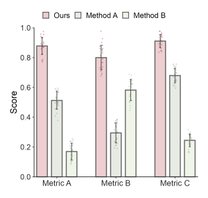</a><br><strong>完整范围的分组柱形图</strong><br><code>rainbow-transparent</code><br><a href="examples/grouped-distributions-legend-space/prompt.md">Prompt 与 CSV</a> · <a href="examples/grouped-distributions-legend-space/preview.png">实际导出</a></td>
</tr></table>

### 断轴箱线图

<table><tr>
<td align="center" width="300"><a href="examples/broken-box-vertical/prompt.md">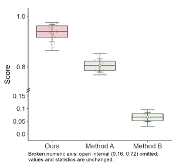</a><br><strong>纵向断轴箱线图</strong><br><code>rainbow-transparent</code><br><a href="examples/broken-box-vertical/prompt.md">Prompt 与 CSV</a> · <a href="examples/broken-box-vertical/preview.png">实际导出</a></td>
<td align="center" width="300"><a href="examples/broken-box-horizontal/prompt.md">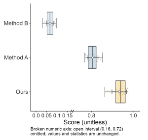</a><br><strong>横向断轴箱线图</strong><br><code>blue-yellow-transparent</code><br><a href="examples/broken-box-horizontal/prompt.md">Prompt 与 CSV</a> · <a href="examples/broken-box-horizontal/preview.png">实际导出</a></td>
</tr></table>

### 趋势比较

<table><tr>
<td align="center" width="300"><a href="examples/trend-two-models/prompt.md">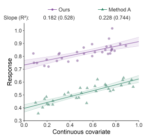</a><br><strong>双方法线性趋势</strong><br><code>muted-green-blue-purple</code><br><a href="examples/trend-two-models/prompt.md">Prompt 与 CSV</a> · <a href="examples/trend-two-models/preview.png">实际导出</a></td>
<td align="center" width="300"><a href="examples/trend-polynomial/prompt.md">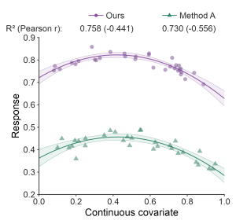</a><br><strong>多项式趋势</strong><br><code>muted-green-blue-purple</code><br><a href="examples/trend-polynomial/prompt.md">Prompt 与 CSV</a> · <a href="examples/trend-polynomial/preview.png">实际导出</a></td>
<td align="center" width="300"><a href="examples/trend-dual-metric/prompt.md">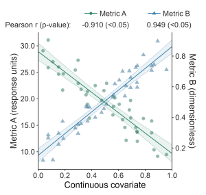</a><br><strong>双指标双轴趋势</strong><br><code>muted-green-blue-purple</code><br><a href="examples/trend-dual-metric/prompt.md">Prompt 与 CSV</a> · <a href="examples/trend-dual-metric/preview.png">实际导出</a></td>
</tr></table>

<table><tr>
<td align="center" width="300"><a href="examples/trend-multi-model/prompt.md">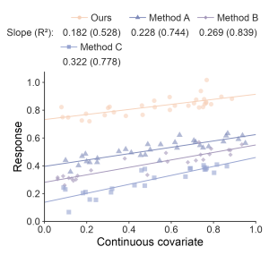</a><br><strong>四方法线性趋势</strong><br><code>blue-pink-purple-peach-transparent</code><br><a href="examples/trend-multi-model/prompt.md">Prompt 与 CSV</a> · <a href="examples/trend-multi-model/preview.png">实际导出</a></td>
<td align="center" width="300"><a href="examples/trend-categorical-horizontal/prompt.md">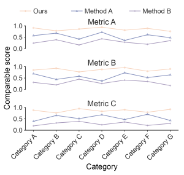</a><br><strong>横轴分类，三个指标</strong><br><code>blue-pink-purple-peach-transparent</code><br><a href="examples/trend-categorical-horizontal/prompt.md">Prompt 与 CSV</a> · <a href="examples/trend-categorical-horizontal/preview.png">实际导出</a></td>
<td align="center" width="300"><a href="examples/trend-categorical-vertical/prompt.md">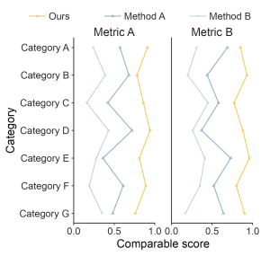</a><br><strong>纵轴分类，两个指标</strong><br><code>blue-yellow-transparent</code><br><a href="examples/trend-categorical-vertical/prompt.md">Prompt 与 CSV</a> · <a href="examples/trend-categorical-vertical/preview.png">实际导出</a></td>
</tr></table>

### 雷达图

<table><tr>
<td align="center" width="300"><a href="examples/radar-comparison/prompt.md">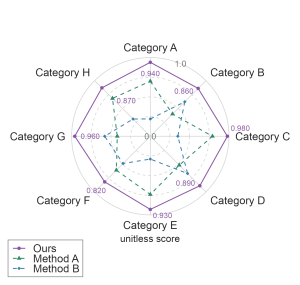</a><br><strong>雷达图：绿蓝紫</strong><br><code>muted-green-blue-purple</code><br><a href="examples/radar-comparison/prompt.md">Prompt 与 CSV</a> · <a href="examples/radar-comparison/preview.png">实际导出</a></td>
<td align="center" width="300"><a href="examples/radar-comparison-rainbow/prompt.md">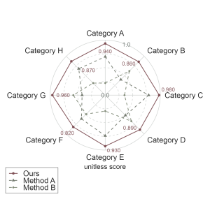</a><br><strong>雷达图：彩虹</strong><br><code>rainbow-transparent</code><br><a href="examples/radar-comparison-rainbow/prompt.md">Prompt 与 CSV</a> · <a href="examples/radar-comparison-rainbow/preview.png">实际导出</a></td>
</tr></table>

<table><tr>
<td align="center" width="300"><a href="examples/radar-comparison-pastel/prompt.md">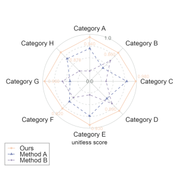</a><br><strong>雷达图：蓝粉紫桃</strong><br><code>blue-pink-purple-peach-transparent</code><br><a href="examples/radar-comparison-pastel/prompt.md">Prompt 与 CSV</a> · <a href="examples/radar-comparison-pastel/preview.png">实际导出</a></td>
<td align="center" width="300"><a href="examples/radar-comparison-bands/prompt.md">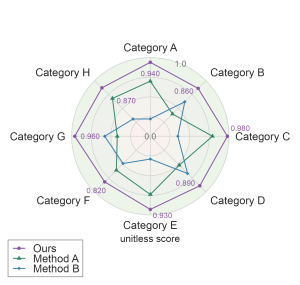</a><br><strong>雷达图：绿色渐变环带</strong><br><code>muted-green-blue-purple</code><br><a href="examples/radar-comparison-bands/prompt.md">Prompt 与 CSV</a> · <a href="examples/radar-comparison-bands/preview.png">实际导出</a></td>
</tr></table>

### 分组环形热图与小提琴图

<table><tr>
<td align="center" width="300"><a href="examples/grouped-circular-heatmap-blue-yellow/prompt.md"></a><br><strong>环形热图：蓝黄</strong><br><code>blue-yellow</code><br><a href="examples/grouped-circular-heatmap-blue-yellow/prompt.md">Prompt 与 CSV</a> · <a href="examples/grouped-circular-heatmap-blue-yellow/preview.png">实际导出</a></td>
<td align="center" width="300"><a href="examples/grouped-circular-heatmap-pastel/prompt.md"></a><br><strong>环形热图：蓝粉紫桃</strong><br><code>blue-pink-purple-peach</code><br><a href="examples/grouped-circular-heatmap-pastel/prompt.md">Prompt 与 CSV</a> · <a href="examples/grouped-circular-heatmap-pastel/preview.png">实际导出</a></td>
</tr></table>

<table><tr>
<td align="center" width="300"><a href="examples/grouped-circular-heatmap-one-group/prompt.md">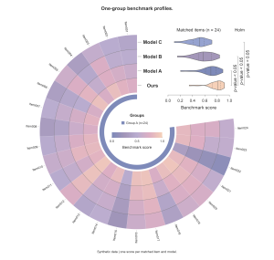</a><br><strong>环形热图：1 个组</strong><br><code>blue-pink-purple-peach</code><br><a href="examples/grouped-circular-heatmap-one-group/prompt.md">Prompt 与 CSV</a> · <a href="examples/grouped-circular-heatmap-one-group/preview.png">实际导出</a></td>
<td align="center" width="300"><a href="examples/grouped-circular-heatmap-three-groups/prompt.md">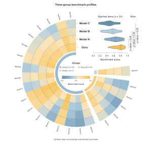</a><br><strong>环形热图：3 个不等大的组</strong><br><code>blue-yellow</code><br><a href="examples/grouped-circular-heatmap-three-groups/prompt.md">Prompt 与 CSV</a> · <a href="examples/grouped-circular-heatmap-three-groups/preview.png">实际导出</a></td>
</tr></table>

<table><tr>
<td align="center" width="300"><a href="examples/grouped-circular-heatmap-eight-groups/prompt.md"></a><br><strong>环形热图：8 个不等大的组</strong><br><code>blue-yellow</code><br><a href="examples/grouped-circular-heatmap-eight-groups/prompt.md">Prompt 与 CSV</a> · <a href="examples/grouped-circular-heatmap-eight-groups/preview.png">实际导出</a></td>
<td align="center" width="300"><a href="examples/grouped-circular-heatmap-twelve-groups/prompt.md">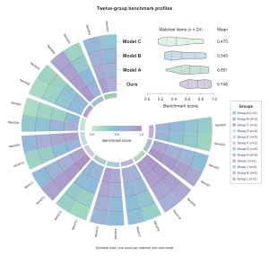</a><br><strong>环形热图：12 个小组</strong><br><code>muted-green-blue-purple-light</code><br><a href="examples/grouped-circular-heatmap-twelve-groups/prompt.md">Prompt 与 CSV</a> · <a href="examples/grouped-circular-heatmap-twelve-groups/preview.png">实际导出</a></td>
</tr></table>

### 相同数据的不同色板

<table><tr>
<td align="center" width="300"><a href="examples/palette-muted-green-blue-purple/prompt.md"></a><br><strong>Violin palette demonstration</strong><br><code>muted-green-blue-purple</code><br><a href="examples/palette-muted-green-blue-purple/prompt.md">Prompt 与 CSV</a> · <a href="examples/palette-muted-green-blue-purple/preview.png">实际导出</a></td>
<td align="center" width="300"><a href="examples/palette-muted-green-blue-purple-transparent/prompt.md">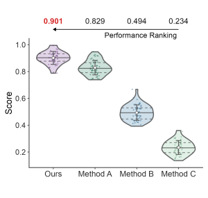</a><br><strong>Violin palette demonstration</strong><br><code>muted-green-blue-purple-transparent</code><br><a href="examples/palette-muted-green-blue-purple-transparent/prompt.md">Prompt 与 CSV</a> · <a href="examples/palette-muted-green-blue-purple-transparent/preview.png">实际导出</a></td>
<td align="center" width="300"><a href="examples/palette-rainbow/prompt.md">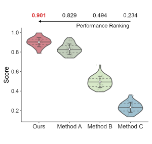</a><br><strong>Violin palette demonstration</strong><br><code>rainbow</code><br><a href="examples/palette-rainbow/prompt.md">Prompt 与 CSV</a> · <a href="examples/palette-rainbow/preview.png">实际导出</a></td>
</tr></table>

<table><tr>
<td align="center" width="300"><a href="examples/palette-rainbow-transparent/prompt.md">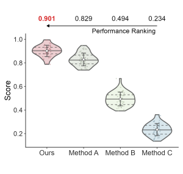</a><br><strong>Violin palette demonstration</strong><br><code>rainbow-transparent</code><br><a href="examples/palette-rainbow-transparent/prompt.md">Prompt 与 CSV</a> · <a href="examples/palette-rainbow-transparent/preview.png">实际导出</a></td>
<td align="center" width="300"><a href="examples/palette-blue-yellow/prompt.md">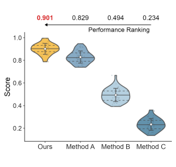</a><br><strong>Violin palette demonstration</strong><br><code>blue-yellow</code><br><a href="examples/palette-blue-yellow/prompt.md">Prompt 与 CSV</a> · <a href="examples/palette-blue-yellow/preview.png">实际导出</a></td>
<td align="center" width="300"><a href="examples/palette-blue-yellow-transparent/prompt.md">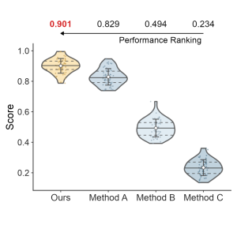</a><br><strong>Violin palette demonstration</strong><br><code>blue-yellow-transparent</code><br><a href="examples/palette-blue-yellow-transparent/prompt.md">Prompt 与 CSV</a> · <a href="examples/palette-blue-yellow-transparent/preview.png">实际导出</a></td>
</tr></table>

<table><tr>
<td align="center" width="300"><a href="examples/palette-blue-pink-purple-peach/prompt.md">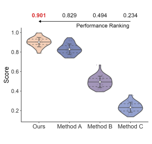</a><br><strong>Violin palette demonstration</strong><br><code>blue-pink-purple-peach</code><br><a href="examples/palette-blue-pink-purple-peach/prompt.md">Prompt 与 CSV</a> · <a href="examples/palette-blue-pink-purple-peach/preview.png">实际导出</a></td>
<td align="center" width="300"><a href="examples/palette-blue-pink-purple-peach-transparent/prompt.md"></a><br><strong>Violin palette demonstration</strong><br><code>blue-pink-purple-peach-transparent</code><br><a href="examples/palette-blue-pink-purple-peach-transparent/prompt.md">Prompt 与 CSV</a> · <a href="examples/palette-blue-pink-purple-peach-transparent/preview.png">实际导出</a></td>
</tr></table>

## 固定色板参考

色板定义固定；透明版本保留相同 RGB，按图形元素应用透明度。科学图中的具体配色标在各预览下方。点击色板参考可查看原始分辨率图片。

<table><tr>
<td align="center" width="900" colspan="2"><a href="examples/palettes/palette-overview.png">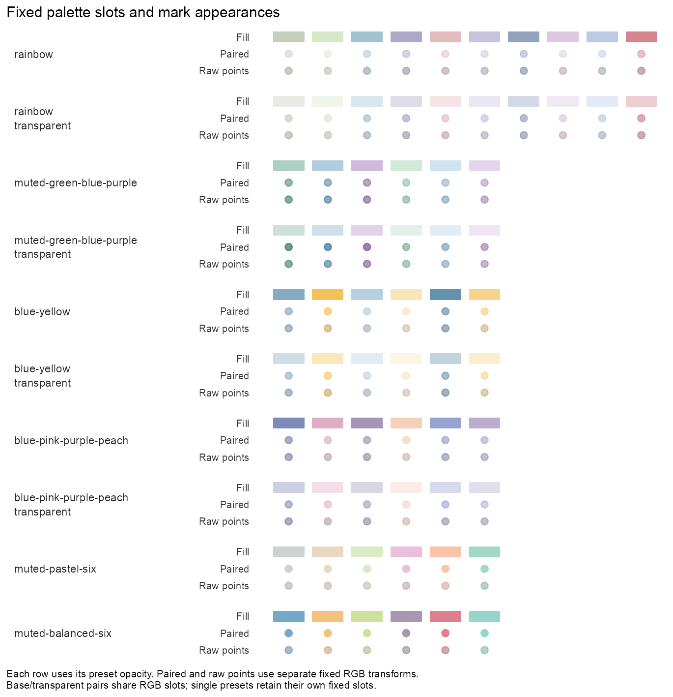</a><br><code>palette-overview</code></td>
</tr><tr>
<td align="center" width="450"><a href="examples/palettes/palette-muted-pastel-six.png">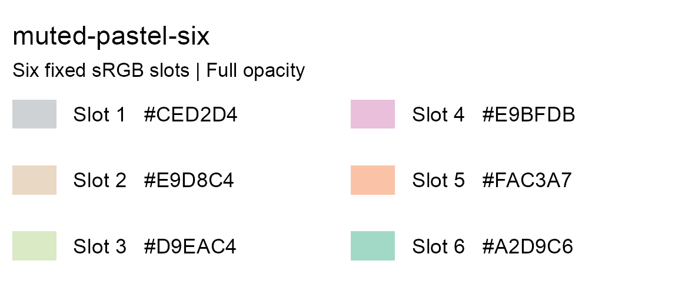</a><br><code>palette-muted-pastel-six</code></td>
<td align="center" width="450"><a href="examples/palettes/palette-muted-balanced-six.png">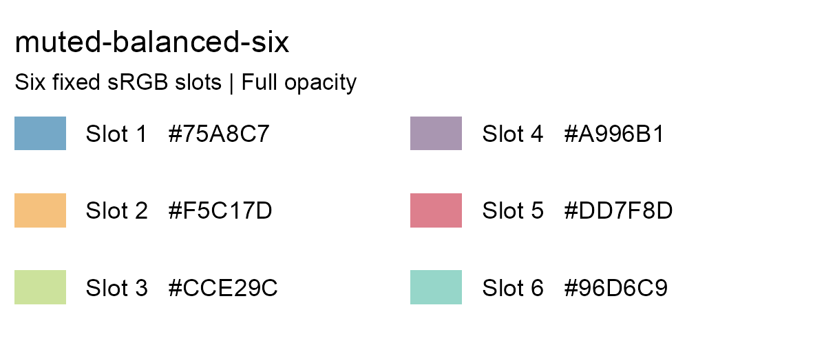</a><br><code>palette-muted-balanced-six</code></td>
</tr></table>

## 文件组织

`examples/<figure-id>/prompt.md` 是面向用户的使用示例，`request.json` 在适用时提供最小配置结构，`preview.png` 是未经修改的科学导出，`preview-card.svg` 将其等比例放入统一尺寸的展示框。共享合成输入集中放在 `examples/data/`。运行时说明、科学契约、可复用渲染器和固定色板分别位于 `SKILL.md`、`references/`、`scripts/` 和 `palettes/`。


## 扩展图形与色板

若需要其他表达形式，请提供结果数据和参考图，并说明需要保留哪些视觉元素。Agent 会检查数据的科学含义，再选择或调整可复用的布局。
